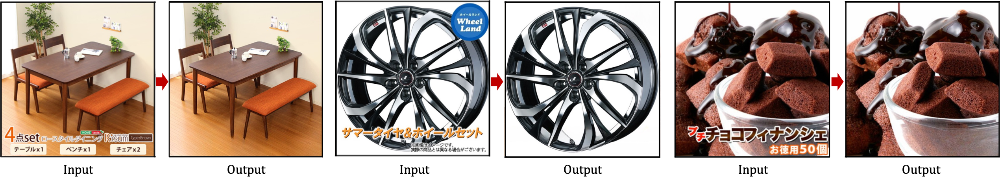

# Text Removal In E-Commerce Images: A Comparison Of Inpainting Methods

by Hiya Roy, Bjorn Stenger

   
Product images on online marketplaces often contain digitally added texts and overlays, hindering their usability for various e-commerce applications. By removing these digital elements, images can be utilized for tasks such as advertisement retargeting. This paper provides an overview of existing inpainting and text removal algorithms, along with a discussion of relevant datasets. We investigate different mask-creation strategies to employ inpainting for the text removal task and show that these have a significant impact on performance. We conduct a thorough analysis of inpainting algorithms with evaluations on the public SCUT-EnsText dataset as well as a new e-commerce product dataset. We show that with appropriate mask definitions, inpainting with Fourier convolution networks can outperform more recent diffusion-based methods both in terms of speed and accuracy. This study represents the first comprehensive survey to discuss the suitability of inpainting methods within the context of e-commerce applications.

[[Project page](https://hiyaroy12.github.io/ecomm-img-text-removal/)]

<<<<<<< HEAD

=======

>>>>>>> 1a0f3c8e9e44c09e61c7585361f6eb743ce040c3
